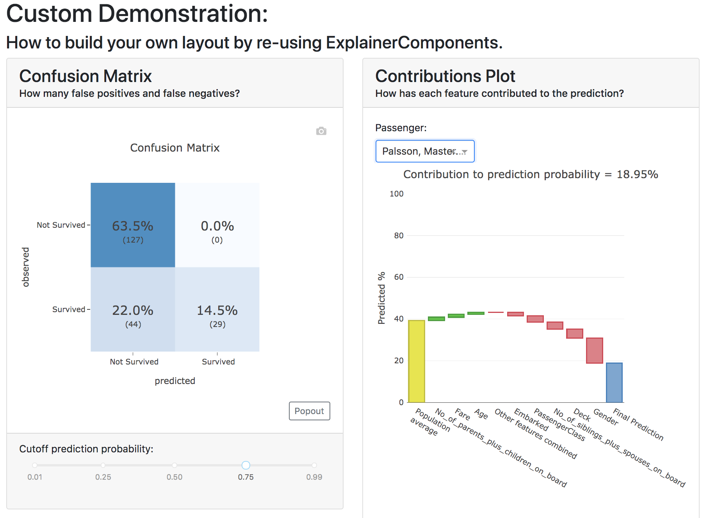

Building custom layout
**********************

You can build your own custom dashboard layout by re-using the modular  
ExComponents and connectors without needing 
to know much about web development or even much about `plotly dash <https://dash.plotly.com/>`_, 
which is the underlying technology that ``ExAI`` is built on.

Simple Example
==============

For example if you only wanted to build a custom dashboard that only contains 
a ``ConfusionMatrixComponent`` and a ``ShapContributionsGraphComponent``, 
but you want to hide a few toggles::

    from ExAI.custom import *

    class CustomDashboard(ExComponents):
        def __init__(self, explainer, name=None, **kwargs):
            super().__init__(explainer, title="Custom Dashboard")
            self.confusion = ConfusionMatrixComponent(explainer, 
                                hide_selector=True, hide_percentage=True,
                                cutoff=0.75, **kwargs)
            self.contrib = ShapContributionsGraphComponent(explainer, 
                                hide_selector=True, hide_cats=True, 
                                hide_depth=True, hide_sort=True,
                                index='Rugg, Miss. Emily', **kwargs)
            
        def layout(self):
            return dbc.Container([
                dbc.Row([
                    dbc.Col([
                        html.H1("Custom Demonstration:"),
                        html.H3("How to build your own layout using ExComponents.")
                    ])
                ]),
                dbc.Row([
                    dbc.Col([
                        self.confusion.layout(),
                    ]),
                    dbc.Col([
                        self.contrib.layout(),
                    ])
                ])
            ])

    db = ExAI(explainer, CustomDashboard, hide_header=True)
    db.run()

So you need to 

1. Import ``ExComponents`` with ``from ExAI.custom import *``. (this also
   imports ``dash_html_components as html``, ``dash_core_components as dcc`` and
   ``dash_bootstrap_components as dbc`` for you.

2. Derive a child class from ``ExComponents``. 

3. Include ``explainer, name=None`` in your ``__init__()``.

4. Call the init of the parent class with ``super().__init__(explainer, title)``. 

5. Instantiate the components that you wish to include as attributes in your ``__init__``: 
   ``self.confusion = ConfusionMatrixComponent(explainer)`` and 
   ``self.contrib = ShapContributionsGraphComponent(explainer)``

6. Define a ``layout()`` method that returns a custom layout.

7. Build your layout using ``html`` and bootstrap (``dbc``) elements and 
   include your components' layout in this overall layout with ``self.confusion.layout()``
   and ``self.contrib.layout()``.

8. Pass the class to an ``ExAI`` and ``run()`` it. 

You can find the list of all ``ExComponents`` in the documentation.

.. note::
    To save on boilerplate code, parameters in the ``__init__`` will automagically be 
    stored to attributes by ``super().__init__(explainer, title)``. So in the example 
    below you do not have to explicitly call ``self.a = a`` in the init::

        class CustomDashboard(ExComponents):
            def __init__(self, explainer, name=None, a=1):
                super().__init__(explainer)

        custom = CustomDashboard(explainer)
        assert custom.a == 1

    This includes the naming of the component itself, by setting ``name=None``, 
    in the ``__init__``. ``ExAI`` will then assign a unique 
    name of your component to make sure that component `id`'s will not clash,
    but will be consistent with multi worker or multi node deployments.

Including ExComponents in regular ``dash`` app
=====================================================

An ``ExComponents`` can easily be included in regular `dash <https://dash.plotly.com/>`_ code::

    import dash 

    custom = CustomDashboard(explainer)

    app = dash.Dash(__name__)
    app.title = "Dash demo"
    app.layout = html.Div([
        custom.layout()
        ])
    custom.register_callbacks(app)
    app.run_server()

Constructing the layout
=======================

You construct the layout using ``dash_bootstrap_components`` and
``dash_html_components``:

dash_bootstrap_components
-------------------------

Using the ``dash_bootstrap_components`` library it is very easy to construct
a modern looking responsive web interface with just a few lines of python code. 

The basis of any layout is that you divide your layout
into ``dbc.Rows`` and then divide each row into a number of ``dbc.Cols`` where the total 
column widths should add up to 12. (e.g. two columns of width 6 each)

Then ``dash_bootstrap_components`` offer a lot of other modern web design 
elements such as cards, modals, etc that you can find more information on in
their documentation: `https://dash-bootstrap-components.opensource.faculty.ai/ <https://dash-bootstrap-components.opensource.faculty.ai/>`_

dash_html_components
--------------------

If you know a little bit of html then using ``import dash_html_components as html`` you
can add further elements to your design. For example in order to insert a header
add ``html.H1("This is my header!")``, etc.

Elaborate Example
=================

CustomModelTab
--------------

A more elaborate example is below where we include three components: the 
precision graph, the shap summary and the shap dependence component, and
add explanatory text on either side of each component. The ``ShapSummaryDependenceConnector``
connects a ShapSummaryComponent and a ShapDependenceComponent so that when you 
select a feature in the summary, it automatically gets selected in the dependence 
plot. You can find other connectors such :ref:`IndexConnector<IndexConnector>`,
:ref:`PosLabelConnector<PosLabelConnector>`, :ref:`CutoffConnector<CutoffConnector>`
and :ref:`HighlightConnector<HighlightConnector>` in the :ref:`Connector documentation<Connectors>`::

.. note::
    All subcomponents that are defined as attibutes in the ``__init__``, either
    explicitly or automagically through the ``super().__init__``, and 
    hence are added to ``self.__dict__`` also automatically get their callbacks 
    registered when you call ``.register_callbacks(app)`` on the parent component. 
    If you would like to exclude that (for example because the subcomponent has 
    already been initialized elsewhere and you just need to store the reference),
    then you can exclude it with ``exclude_callbacks(components)``::

        class CustomDashboard(ExComponents):
            def __init__(self, explainer, name=None, feature_input_component):
                super().__init__(explainer)
                self.exclude_callbacks(self.feature_input_component)

CustomPredictionsTab
--------------------

We can also add another tab to investigate individual predictions, that 
includes an index selector, a SHAP contributions graph and a Random Forest
individual trees graph. The ``IndexConnector`` connects the index selected
in ``ClassifierRandomIndexComponent`` with the index dropdown in the 
contributions graph and trees components. We also pass a 
custom `dbc theme <https://dash-bootstrap-components.opensource.faculty.ai/docs/themes/>`_ 
called FLATLY as a custom css file::

Comparing multiple models
=========================

You can also compare multiple models in the same dashboard, or inside the same
tab. In this case it is important to already instantiate the component/tab before
passing it on to the ``ExAI``::

Custom static html export
=========================

To enable your custom dashboard to be exported to html you need to define a ``to_html`` method
that returns an html layout. There are helper functions in ``ExAI.to_html`` to
help you construct this html using python code, which get automatically loaded when 
you ``from ExAI.custom import *``::

So the arguments of ``to_html()`` should be ``(self, state_dict=None, add_header=True)``, and you
should pass ``(state_dict, add_header=False)`` to all sub-components. Only the top-level
component should add a html header (which links to bootstrap css and javascript and
triggers a window resize in order to fix plotly figure overflow issues). 

If you build your own components whose display depend on the state of various toggles
that you put in the dash layout, you need to define input component id's as a ``_state_props``
class attribute. This should be a dict with the keys equal to ``__init__`` parameters,
and the values a tuple identifying the dash component id and property. The id's should
be without `+self.name` as this will get automatically added behind the scenes. (and since it's 
a class attribute it doesn't have access to ``self`` in any case).

You can then call ``args = self.get_state_args(state_dict)`` to get the current values
of the parameters inside your ``to_html`` method. When you call the method directly 
from the component (e.g. inside a jupyter notebook), it will gather the arguments 
from the instance properties (so wil e.g. return ``{'cutoff': self.cutoff}``), so it 
will output html based on the initial values.
When clicking the download button on a running dashboard, it will substitute the current
values of the dashboard state. These values get collected in ``state_dict``, which is 
why it is important to pass ``state_dict`` down to subcomponents. 

When exporting to html you probably want to set a default ``index`` value for your 
``ExAI``. This is the index that will be displayed in the plots
with individual rows of data when you call 
``ExAI.to_html()`` directly, e.g. 
``ExAI(explainer, index=0).to_html('dashboard.html')``.
